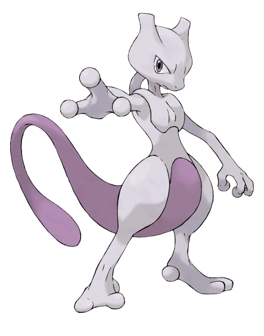

# mewtwo
mewtwo, a successor to mew, is a high-level, class-based, object-oriented programming language that is inspired by Java. Mewtwo comes with its own virtual machine call MVM aka Mewtwo Virtual Machine. 
